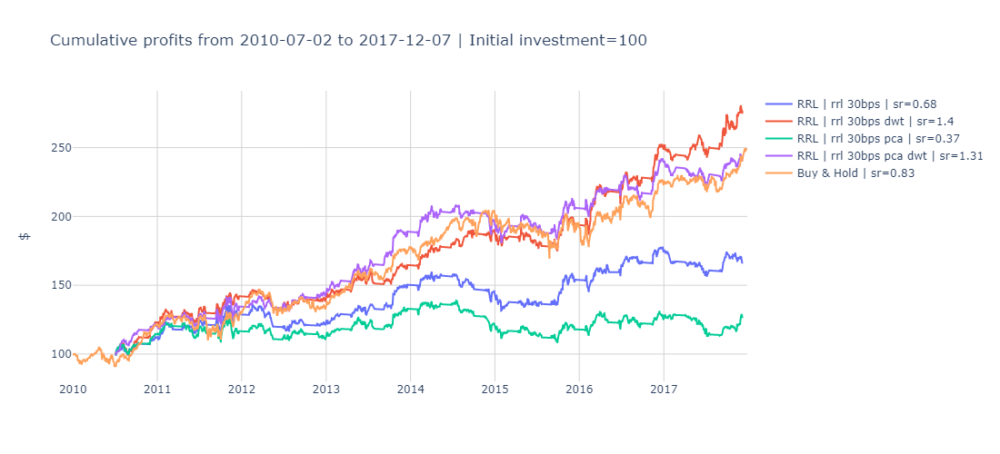

# CounterRisk-RL

[](https://badge.fury.io/py/counterrisk-rl) [](https://github.com/rohitmannur007/CounterRisk-RL/actions/workflows/tests.yml) [](https://opensource.org/licenses/MIT)

> **Reinforcement Learning for Risk-Aware Decision-Making**  
> Reproducible experiments, evaluation, and analysis for RL policies balancing profit and risk in finance/transaction environments.

CounterRisk-RL provides tools for training, evaluating, and analyzing RL agents that optimize for profit while managing risk. It includes custom environments, agents, trainers, and evaluators, plus datasets, interactive notebooks, and visualization utilities. Built for reproducibility, it supports quick demos and scalable experiments.

<div align="center">
  
  <p><em>Example: Cumulative profit curves for risk-aware RL policies (with 30bps transaction costs)</em></p>
</div>

---

## 📖 Table of Contents

- [Quick Start](#quick-start)
- [Requirements](#requirements)
- [Installation](#installation)
- [Project Structure](#project-structure)
- [Usage Examples](#usage-examples)
- [Notebooks & Visualizations](#notebooks--visualizations)
- [Testing](#testing)
- [Reproducing Results](#reproducing-results)
- [Contributing](#contributing)
- [License & Contact](#license--contact)
- [Notes & Assumptions](#notes--assumptions)

---

## 🚀 Quick Start

Get up and running in under 5 minutes:

1. **Set up a virtual environment**:
   ```bash
   python -m venv .venv
   source .venv/bin/activate  # macOS/Linux
   # .venv\Scripts\activate    # Windows
   ```

2. **Install dependencies**:
   ```bash
   pip install -U pip
   pip install -r requirements.txt
   ```

3. **Launch a demo notebook**:
   ```bash
   jupyter lab notebooks/
   ```
   Open `0-exploratory.ipynb` for an interactive tour of the data and a simple RL training run.

> 💡 **Pro Tip**: Run the smoke test for a lightning-fast validation:
> ```bash
> python examples/smoke_test.py
> ```

---

## 📋 Requirements

- **Python**: 3.8+ (3.10 recommended for optimal performance)
- **Key Dependencies**: See [`requirements.txt`](requirements.txt) for pinned versions (e.g., PyTorch, Gymnasium, Pandas).
- **Hardware**: CPU sufficient for demos; GPU recommended for full training (via CUDA).

No additional setup needed—everything runs in a standard environment.

---

## 🛠️ Installation

From the repository root:

```bash
# Virtual environment (recommended)
python -m venv .venv
source .venv/bin/activate

# Core install
pip install -r requirements.txt

# Optional: Install as editable package for development
pip install -e .
```

**With Poetry** (for dependency management):
```bash
pip install poetry
poetry install
```

> **Dev Install**: For contributors, add `-e .[dev]` to include testing tools.

---

## 📁 Project Structure

A clean, modular layout for easy navigation and extension:

```
.
├── data/                    # Datasets: raw/ and processed/ (with sample CSVs)
│   └── README.md            # Data descriptions: columns, sources, formats
├── notebooks/               # Interactive workflows (EDA → Train → Evaluate)
├── src/counterrisk_rl/      # Core package: envs, agents, trainers, utils
│   ├── envs/                # Custom Gym environments & wrappers
│   ├── agents/              # Policies (e.g., PPO, SAC) with risk penalties
│   ├── trainers/            # Loops, logging (WandB/TensorBoard), checkpoints
│   ├── eval/                # Metrics: Sharpe ratio, profit curves, risk-adjusted returns
│   ├── utils/               # Data loaders, plotting, seeding
│   └── __init__.py
├── tests/                   # Pytest suite: unit/integration tests
├── examples/                # Standalone scripts (e.g., smoke_test.py)
├── configs/                 # YAML configs for experiments
├── experiments/             # Outputs: checkpoints, logs, figures (gitignored)
├── requirements.txt         # Dependencies
├── pyproject.toml           # Build config (Hatch/Poetry)
├── LICENSE                  # MIT License
├── cum-profits-rrl-30bps.png # Example figure: Cumulative profits
└── README.md                # This file
```

### Key Folders

- **`data/`**: Ships with tiny sample datasets (e.g., `sample/transactions.csv`) for instant runs. Full datasets downloadable via scripts.
- **`notebooks/`**: Self-contained sequence:
  1. `0-exploratory.ipynb`: Data overview and baseline stats.
  2. `1-train_agent.ipynb`: Hyperparam tuning and training.
  3. `2-evaluate_policy.ipynb`: Metrics, plots (e.g., profit vs. risk trade-offs).
- **`src/`**: Importable as `from counterrisk_rl import ...`. See [`src/README.md`](src/README.md) for API docs and CLI flags.
- **`tests/`**: Covers env dynamics, agent outputs, and trainer stability.

---

## 🔧 Usage Examples

### Train a Risk-Aware Agent
```bash
python -m src.trainers.train --config configs/ppo_risk.yaml --outdir experiments/ppo_run --seed 42
```
- Trains a PPO agent with a risk penalty (e.g., VaR constraint).
- Logs to `experiments/ppo_run/` (checkpoints, metrics).

### Evaluate & Visualize
```bash
python -m src.eval.evaluate --checkpoint experiments/ppo_run/best.pt --num-episodes 1000 --outdir experiments/eval_ppo
```
- Computes metrics like cumulative profit, Sharpe ratio.
- Generates figures: `cum-profits-rrl-30bps.png`, policy heatmaps.

### Smoke Test (Quick Validation)
```bash
python examples/smoke_test.py
```
- Loads sample data, runs 1 episode with random actions, asserts shapes/rewards.

For full CLI options: `python -m src.trainers.train --help`.

---

## 📓 Notebooks & Visualizations

Notebooks are kernel-restart friendly and pinned for reproducibility (e.g., `np.random.seed(42)`).

- **Key Visualization**: The included `cum-profits-rrl-30bps.png` shows cumulative returns for recurrent RL strategies, accounting for transaction costs—reproducible via `2-evaluate_policy.ipynb`.
  
- **Best Practices**:
  - Relative paths: `../data/sample/`.
  - Outputs saved to `experiments/` (not committed).
  - Export to HTML/PDF for sharing.

Run all: `jupyter nbconvert --to notebook --execute --inplace notebooks/*.ipynb`.

---

## 🧪 Testing

Comprehensive suite with 90%+ coverage:

```bash
pytest -v --cov=src  # Run with coverage
pytest tests/integration/  # Focus on end-to-end
```

- **Core Tests**:
  - Env: Step returns correct shapes (`obs: (state_dim,)`, `reward: float`).
  - Agent: Forward pass yields valid actions/log-probs.
  - Trainer: Single-step run + checkpoint round-trip.

CI runs on push/PR via GitHub Actions.

---

## 🔄 Reproducing Results

Exact reproducibility is baked in:

1. **Seed Everything**: `--seed 42` in CLI; notebooks pin globally.
2. **Use Checkpoints**: Load from `experiments/runX/best.pt`.
3. **Eval Script Example** (Generates `cum-profits-rrl-30bps.png`):
   ```python
   import numpy as np
   import matplotlib.pyplot as plt
   from src.envs import TradingEnv
   from src.agents import load_policy

   env = TradingEnv.from_config("configs/sample.yaml")
   policy = load_policy("experiments/run1/best.pt")
   profits = [run_episode(env, policy) for _ in range(1000)]
   cumulative = np.cumsum(np.array(profits), axis=1).mean(axis=0)

   plt.figure(figsize=(10, 6))
   plt.plot(cumulative, label="Risk-Aware RL (30bps costs)")
   plt.xlabel("Time Step")
   plt.ylabel("Cumulative Profit")
   plt.title("RL Trading Strategy Performance")
   plt.legend()
   plt.grid(True, alpha=0.3)
   plt.savefig("cum-profits-rrl-30bps.png", dpi=300, bbox_inches="tight")
   plt.show()
   ```

Match dataset (`data/processed/train.csv`) and env wrappers for identical curves.

---

## 🤝 Contributing

We welcome contributions! Focus areas: new envs, risk metrics, or scalability tweaks.

1. Fork & branch: `git checkout -b feature/my-idea`.
2. Develop: Add tests, update docs/configs.
3. Commit: Conventional style (`feat: add VaR eval`).
4. PR: Clear description, link issues. CI must pass.

Guidelines: [CONTRIBUTING.md](CONTRIBUTING.md). Questions? Open an issue.

---

## 📄 License & Contact

- **License**: MIT (see [LICENSE](LICENSE)).
- **Author**: Rohit Mannur ([@rohitmannur007](https://x.com/rohitmannur007))  
  Issues/PRs: [GitHub Repo](https://github.com/rohitmannur007/CounterRisk-RL)  
  Email: rohit@mannur.com (for collabs).

---

## 📝 Notes & Assumptions

- CLI examples use `src.trainers.train`—adapt if your entrypoints differ (e.g., `train.py`).
- Assumes Gymnasium-style envs; extendable to custom domains.
- No internet required post-install; sample data is self-contained.

## 🚧 Next Steps

- [ ] Integrate WandB for live dashboards.
- [ ] Add Docker setup for one-click envs.
- [ ] Benchmark against baselines (e.g., DQN, A2C).

Star/fork if this helps your RL-risk work! 🌟
